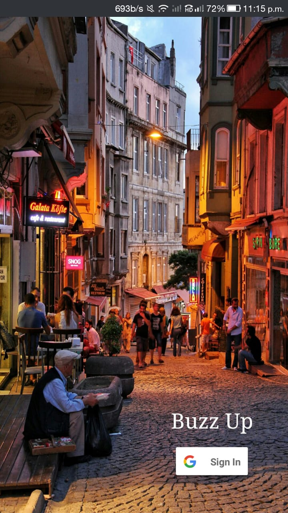

# Buzz-Up

Demo link - https://www.youtube.com/watch?v=vi2PKOwkEqo

Buzz Up is a Social App which lets like-minded people come together for local Buzz around them. How often is it that we want to organise a cricket match on Sunday or host a house get together party for all your local peeps or maybe just a simple elClassico Screening in the local bar? We often tend to be limited about knowledge of such local events. Buzz up lets you know about all the Local Buzz happening around you. It has been fully powered with MongoDB Stitch and MongoDB Mobile with Sync to get the best of Serverless and Geofencing into your app.

<p align="center">
 &nbsp; &nbsp; &nbsp; &nbsp; &nbsp; &nbsp; &nbsp; &nbsp; &nbsp; 
</p>

## Walkthrough

It starts with a login screen, asking for Google Login. Once logged in, It will show you the Top Trending Local Buzz in and around you, typically upto 2 miles.  These Buzz have been ranked based on User popularity and user engagement. We can add a New Buzz by clicking the plus icon on the bottom right. It will ask for a Buzz Name (which should be a single word hashtag), the Date till which the Buzz should be active and the location of the Buzz happening nearby. We can set the location to Current User's location, or pick one from Google Maps.

When created, it will be directly synced to Atlas and your own local device. By any chance, if your net connection breaks down, Buzz up will still allow you to create a new Buzz and will sync automatically. It allows you to check your own hosted Buzz' in the profile section, which even works when you are offline.

You can click on any Buzz, and it will open up a chat room for that particular Buzz. This chat system has been also fully developed using MongoDB Mobile, with appropriate optimizations, to harness the power of Sync. Let's add a new message by another device now and see how long does it take to appear. You can discuss, chat and get to know each other, without your private details such as email or phone number being leaked to the public.

Additionally, each Buzz has its own information page, where you can check who hosts the Buzz and till when would it be active. Each information page also provides you with a "Go to location" button which will open up Google Maps for you to visit the Buzz location on the event date.

The owner or host, can also modify the information of their Buzz which will be reflected as soon as you have a working internet connection.

In the end, each user would be subscribed to the Buzz Up mailing list. Users can get an automated email when a new Buzz goes trendy around them, or could get a listing of such Buzz on say, every friday. This has been done by using Stitch Triggers and Azure Logic Apps.

# Setup

1. Git clone the repository.
2. Import the stitch app in folder **stitch-app**.
3. Create a new file **secrets.xml** in the path - **path_to_repo/app/src/main/res/values** and add 3 strings as follows - 
```
<?xml version="1.0" encoding="utf-8"?>
<resources>
    <string name="initialiseClient">Your Stitch App ID</string>
    <string name="serverAuthCode">Google Web App Client ID</string>
    <string name="googleApiKey">Google API Key for GMaps and PlacesAPI</string>
</resources>
```
Keep in mind to also generate an Android App cred in Google with your SHA1 key for Login.

4. Open the app in Android Studio and build.

## MongoDB Products Used
1. MongoDB Atlas - For mainting the database on Cloud and integrate with Stitch.
2. MongoDB Stitch - Mainly for Geofencing queries, auth and servcies.
3. Mongodb Mobile with Sync - For every other Backend Operation.

## Extra Tech Stacks used
1. Android Studio
2. Google Cloud Apis - Maps and Places API
3. Microsoft Azure - Logic App to send customised Email Triggers

## Team 
Shrey Batra and Nishtha paul
